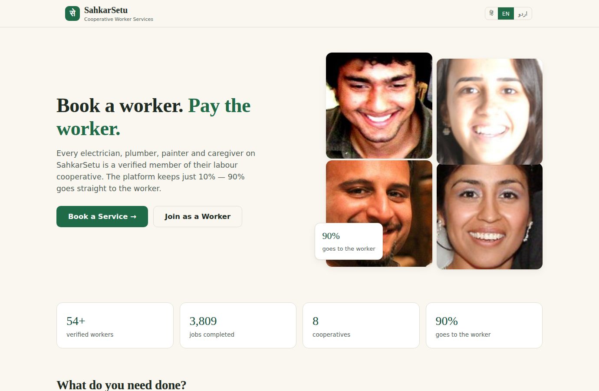

# SahkarSetu — सहकारी कामगार मंच

**Cooperative gig-services platform for household & community work** — our build for
**Smart India Hackathon 2026, Problem Statement SIH26089** (Ministry of Cooperation / NCCT).

A digital marketplace where *labour cooperatives* — not a private middleman — verify workers,
route bookings, and pay wages. The platform's cut is a flat, printed **10%**: 90% of every
rupee reaches the worker. Built as a working product, not slides.

**Live demo:** https://jr29e-5001.aiccloud.online/ · **License:** MIT




> **Audit build (21 Sep 2026):** a full production-readiness pass is done — every finding,
> its evidence, and the fix is in [`docs/AUDIT_REPORT.md`](docs/AUDIT_REPORT.md);
> the requirement-by-requirement map against SIH26089 is in
> [`docs/PS_COMPLIANCE.md`](docs/PS_COMPLIANCE.md); the competitor comparison is in
> [`docs/MARKET_COMPARISON.md`](docs/MARKET_COMPARISON.md).

---

## Quick start (60 seconds)

```bash
pip install -r requirements.txt
python3 -m uvicorn main:app --host 0.0.0.0 --port 3001
# open http://localhost:3001
```

The SQLite database (`data/sahkarsetu.db`) seeds itself **on first boot** — the app creates
`data/`, builds the schema, and loads the demo directory (60 workers across 8 cooperatives,
25 services, ~3,800 historical bookings with Diwali/summer seasonality — that's what the
demand forecast learns from). Booting again just reopens the existing database.

### Configuration (all optional)

| Variable | Default | Purpose |
|---|---|---|
| `SAHKARSETU_PORT` | `3001` | only used by `python3 main.py` |
| `SAHKARSETU_DB` | `./data/sahkarsetu.db` | point a test/QA run at its own database |
| `SAHKARSETU_DATA_DIR` | `./data` | where the DB + JWT key file live |
| `SAHKARSETU_JWT_SECRET` | generated key in `data/jwt_secret.key` | sessions survive restarts; never a source constant |

### Demo accounts

| Role | Phone | Password |
|---|---|---|
| Customer | `9000000001` | `demo123` |
| Worker (Ramesh, electrician) | `8000000001` | `demo123` |
| Federation admin | `7000000001` | `admin123` |
| Samiti admin (Seelampur) | `7000000101` | `admin123` |

Seeded directory workers use `worker@2026` (they exist so the matching engine has supply).

**DEMO MODE — payments are simulated.** No real money moves; every invoice and the footer say so plainly.

## What's inside (mapped to SIH26089's required features)

| PS requirement | Where it lives |
|---|---|
| Service provider registration & verification | `/api/apply-worker` + admin Verification queue (co-op approves → badge) |
| Worker skill profiling & certification | Worker profile: trade, experience, ITI/NSDC certificates, e-Shram UAN (never shown publicly) |
| Customer booking & scheduling | Full lifecycle: requested → accepted → enroute → in_progress → completed (+ cancel and worker-decline paths) |
| Geo-location based matching | Haversine distance over zone coordinates; only FREE workers are ever offered a job |
| Worker agency | A worker can **decline** an offer; it re-routes to the next nearest free worker (or is cancelled honestly) — never stalls on him |
| Digital payments & invoicing | Mock UPI payment + real PDF invoice (`reportlab`) printing the 90/10 split — including Hindi addresses |
| Rating & feedback | One review per completed booking, aggregates recomputed server-side |
| Worker welfare & insurance | PMSBY (₹20/yr) + PMJJBY (₹436/yr) enrolment, federation gap-report, welfare centre in worker hub |
| Emergency & on-demand booking | Emergency toggle → nearest *available* worker, instant accept |
| Federation admin dashboard | Overview, verification, payout runs + bank CSV (duplicate-period guard), welfare centre, demand heatmap |
| Multilingual mobile application | Hindi / English / **Urdu (RTL)**, installable PWA (manifest + service worker + offline page) |
| AI-based demand forecasting | Explainable model: weekday medians × trend ratio — every number recomputable by hand |

## Architecture (deliberately simple)

- **Backend:** one FastAPI app (`main.py`), SQLite (`db.py` schema+seed, WAL mode, one shared
  connection guarded by a lock), JWT sessions (`pyjwt`), PBKDF2-SHA256 password storage.
- **Frontend:** vanilla JS PWA (`static/`), no build step, hash-free router, Leaflet + OpenStreetMap
  (no paid map APIs), monochrome inline-SVG icons (`static/js/icons.js`).
- **Forecast:** `forecast.py` — weekly seasonality medians × trend ratio, per service × zone,
  batched into two queries and cached for 30 s.

```
main.py                 FastAPI app — all routes + serves the PWA
db.py                   schema, demo seed, queries (SQLite, WAL)
forecast.py             demand forecast: weekly medians × trend ratio
static/                 PWA — index.html, js/ views, css/, img/, manifest, service worker
tests/                  QA suites (see below)
tools/make_icons.py     regenerates the PWA icons
docs/                   audit report, PS compliance map, market comparison, screenshots
```

No Docker, no Kubernetes, no build pipeline — a judge can run this on a laptop with Python
and nothing else. That's a feature.

## Security posture (demo-honest)

- Passwords: **PBKDF2-SHA256, 210k rounds, per-user salt**; old single-round hashes upgrade
  automatically on next login; constant-time comparison; equal work for unknown phone numbers
- Sessions: JWT signed with a secret from env / a generated `data/jwt_secret.key` (never hardcoded);
  token in the query string is accepted **only** by the two browser download endpoints
- Rate limiting: login (10 fails / 15 min / phone+IP, plus 40 / 15 min / IP) and registration
  (5 / hour / public IP); bounded in-memory maps
- Input validation: zone allow-list, future-only schedules, per-field length caps, 64 KB request cap
- Privacy: worker phone numbers are masked in public profiles, e-Shram UAN never leaves the server
- Security headers: CSP, X-Frame-Options DENY, nosniff, Referrer-Policy, Permissions-Policy
- All SQL parameterised; XSS-escaped rendering; role checks per endpoint (`require_role`)
- Known demo simplifications: mock payments, shared demo passwords, in-memory rate limits
  (single process), CSP still allows inline handlers. None of these are presented as production-ready.

## Tests

```bash
python3 tests/e2e.py              # API + PDF + validation + activity-log suite — 98 checks
python3 tests/stress.py           # 8-thread adversarial flood + DB invariant sweep
python3 tests/visual_qa.py        # Playwright journeys across all four roles — 22 checks
python3 tests/static_checks.py    # dead-handler + i18n coverage sweep
python3 tests/boot_check.py       # fresh-clone bootstrap: boots a copy with no DB and self-seeds
python3 tests/ps_compliance.py    # maps the running build against SIH26089's features — 26 checks
python3 tests/backend_probe.py    # payouts + expiry + decline on a COPY of the live DB
python3 tests/backfill_events.py  # one-off (idempotent): rebuild the activity log for old bookings
python3 tests/verify_fixes.py     # fix-evidence run: invoice render + endpoint latency table
python3 tests/live_url_check.py   # proves a public URL end-to-end in a real browser
```

The e2e/visual suites drive whichever worker the matcher actually picks (they log in as a
*free* seeded worker), prove payouts on a QA-only future date, and purge every child table
before deleting their bookings, so repeated runs leave the DB exactly as they found it.

`tests/qa_common.py` is shared by the online suites: every suite prints the `BASE`/`DB`
it resolved, then confirms the server's database and `SAHKARSETU_DB` are the same file
(aborting loudly on mismatch) — so a bad env var can never silently pollute the wrong DB.
Point any suite at a non-default instance with
`SAHKARSETU_BASE=http://localhost:5001 SAHKARSETU_DB=/path/to.db python3 tests/e2e.py`.
`purge_junk.py` and `check_live_db.py` are one-off maintenance helpers.

**Verified on this tree (26 Sep 2026):** e2e 98/98 · visual 22/22 · boot 4/4 · static clean ·
PS compliance 26/26 · stress 0 anomalies.

## Image credits

Worker photos: FairFace dataset (Indian subset, CC BY 4.0) — see `static/img/CREDITS.md`.
All names, reviews, bookings and payments are synthetic seed data.

## The honest pitch

`docs/MARKET_COMPARISON.md` compares SahkarSetu against Urban Company / JustDial with cited
sources — including the three things competitors genuinely do better than us.

## License

MIT — see [`LICENSE`](LICENSE).

---

## What the 21 Sep 2026 audit changed

Fixes are listed newest-first in [`docs/AUDIT_REPORT.md`](docs/AUDIT_REPORT.md); this is the short version:

1. **Invoice PDF was broken** — the whole 90/10 breakdown was drawn below the page edge.
   Rebuilt the layout; Hindi/Devanagari text now renders (was silently boxes).
2. **Fresh clone didn't boot** — seeding crashed without a `data/` dir, plain `uvicorn` never
   seeded, and the seeding process closed its own DB connection. Bootstrap is now idempotent at import.
3. **Passwords** — single-round unsalted SHA-256 → PBKDF2-SHA256 (210k) with upgrade-on-login.
4. **Privacy** — worker phone numbers were readable by anonymous visitors → masked.
5. **Validation** — unknown zones, past-dated bookings and 200 KB payloads were accepted → rejected.
6. **Payout** — the API returned a CSV URL that 404'd, and re-running the same period silently
   produced a second payout → fixed URL + duplicate guard.
7. **Matching** — busy workers could be offered jobs they could never accept, stranding bookings →
   single-query matcher that only offers free workers, plus worker decline + re-dispatch.
8. **Efficiency** — admin overview 16 queries → 1; forecast 110 queries → 2 (plus 30 s cache);
   booking matcher N+1 → 1. Measured: overview 15.3 → 4.7 ms, forecast 31.5 → 9.4 ms.
